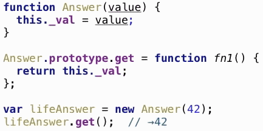

<!-- .slide: data-background="images/INTRO.PNG" data-background-size="80%"-->
# 
## Javascript da 0 a ES6
Corso **FIP** del 08/6 e 06/7 2017 - 
*Ing. Daniele Morosinotto*

--

<!-- .slide: data-background="images/XE.PNG" data-background-size="80%"-->
## Chi sono


---

# Introduzione a Javascript

--

## Un po' di storia
- Creato da [Brendan Hich](https://twitter.com/BrendanEich) (*Netscape*) in **10 giorni** nel 1996
- Basato su concetti derivati da: *Java* , *Scheme* e *Self*	
- Inizialmente fu battezzato come Livescript, poi Netscape ottenne i diritti esclusivi da Sun per chiamarlo **Javascript**
- Introdotto ("copiato") da Microsoft in IE 3.0 con il nome di **JScript**
- Standardizzato sotto il nome di **ECMAScript** nel 1997
- European Computer Manufactorers Association
	- 1999 **ES3** Standardizzazione base di Javascript
	- 2009 **ES5** Intoduzione Strict Mode
	- **2015 ES6 Harmony/ES2015** Introduzione nuove features: *class, arrow function, rest parameters, promise, generators, module* etc...

--

## ECMA Technical Committee 39
[TC39 Members](https://github.com/hemanth/tc39-members/blob/master/members.json) - [Contribute guide](https://github.com/tc39/ecma262/blob/master/CONTRIBUTING.md)


--

## Perchè Javascript?

> IMHO: Forse è uno dei pochi linguaggi veramente **portabile e universale** 

> (ndr. "cross-tutto!" - [JS World Domination](https://medium.com/@slsoftworks/javascript-world-domination-af9ca2ee5070))

Non può essere ignorato, perchè ormai ha un'adozione enorme non solo **client-side** ma anche **server-side** grazie a [*Node.js*](https://nodejs.org/en/).

Sta dimostrando ogni giorno di più, che può essere alla base di "Sviluppi Reali" grazie alla ricchezza di **Framework Applicativi** 
scritti in Javascript che ne sfruttano caratteristiche e potenzialità!

--

## Caratteristiche Linguaggio:
- E' un linguaggio di **scripting**, con sintassi derivata 
da **Java/C** che ne rende facile l'adozione. <small>("purtroppo")</small>

- **Dynamic typing** che non vuol dire che è senza tipi, anzi!
<br/> Ma i tipi sono associati ai *value* non alle variabili.

- **Prototype-base** ereditarieta/estensibilita basata sul prototipo.
<br/> Tramite la quale possiamo simulare anche l'object-oriented!

- **First-class functions** consente paradigmi di prog. funzionale.
Ma è possibile usare anche altri stili di prog. imperativa e OOP.

---

# STATEMENTS

```javascript
statement;      //comment single line

/* comment multi-line
IL ; ALLA FINE DELLO STATEMENT E' OPZIONALE MA CONSIGLIATO!
*/
```

--

## Blocchi Condizionali
```javascript
if (cond) {
	//..then block
} else {
	//..else block
}

/* INLINE */
if (cond) thenInline();

/* TERNARY OPERATOR */
var assigned = cond ? valueIfTrue : valueIfFalse;

switch (expression) { 
	case x: statements; break; 
	default: ...break; //OPZIONALE
}
```

--

## Cicli
```javascript
while (expressionIsTrue) statement;

do {
	statements;
} while (expressionIsTrue);

//initialize; test; increment
for (var i=0;  i<n; i++) {
	statements;
	/* if (cond) break; //EXIT LOOP */
}

for (key in object) {
	doSomethingWith( object[key] );
	//UN-ORDERED! + WALK PROTOTYPE-CHAIN
}
```

--

## Operatori


<br/><small>TRICK: [<code>samples/js/default_guard.js</code>](samples/js/default_guard.js)</small>


--

## Exception
```javascript
try {
  console.log( "before exception thrown" );
  throw new Error("some message");
  console.log( "after exception thrown" ); //NEVER EXECUTE!
} catch (e) {
  console.log( "exception: " + e.message );
} finally{
  console.log( "finally" );
}
```

--

## Variabili e Regole di Scope in JS

- In Javascript esiste solamente lo **SCOPE di Funzione** che definisce il contesto/visibilità delle variabili  
- Tutte le **dichiarazioni** di variabili *var x,y;* e/o *function* definite internamente ad una funzione **subiscono HOISTING**, ossia vengono "spostate" in testa alla funzione! 
- Dalle funzioni interne si ha **visibilità** su tutte le variabili presenti nella funzione padre, nonno ... e ricorsivamente **fino ad arrivare all'oggetto global / window** sempre se prima non hanno subito **SHADOWING**, ossia sono state ridefinite in un livello intermedio usando lo stesso nome.

--

## Definizioni varibili
```javascript
var globalVar1 = 100;    // Varibile Globale dichiarata normalmente

window.globalVar2 = 200; // Variabile Globale assegnazione esplicita!

function nonStrictFunc(){
/*"use strict";	// ECMAScript 5: exception thrown */
  globalVar3 = 300;  // ATTENTIONE: MANCA VAR !!!
  var local = "abc"; // Varibile locale alla funzione
  deeperFunc(local); // Esegue funzione (HOISTING OK)
  console.log("INSIDE FUNC", local, globalVar3);
  
  function deeperFunc(par) {
      var local; //SHADOWING delle variabili =abc?? 
      console.log("IN DEEP FUNC", guess, par, local);
      var guess = "my value is?"; //HOISING var NON inizializzazione!
  }
}
nonStrictFunc(); //Esegue funzione -> GLOBAL POLLUTION se non uso var!

console.log( globalVar1 ); //100
console.log( globalVar2 ); //200
console.log( globalVar3 ); //300 fuori dalle FUNC -> Global Pollution!
```

--

## Definizione di funzioni

```javascript
function funcName(par1,par2...) { 
	...  
	return exp;
}
```

- parola chiave **function**
- *funcName* il **nome** funzione che è **opzionale** 
- elenco di **parametri 0+** racchiuso tra **( , )** e separati da virgola
- **corpo** della funzione racchiuso tra ** { **...** } **
    - contentente 0 o più istruzioni javascript 
    - eventuale **return** (se non presente ritorna *undefined*)
- Una **Function Expression** è praticamente il modo di definire un **Literal** *per un oggetto di tipo* **Function**!

--

## Parametri vs arguments
* In Javascript nella dichiarazione della funzione vengono indicati i **parametri** che accetta in ingresso.
```javascript
function fn(par1,par2, ..., parM) { ... }; 
//NESSUN VINCOLO SUL TIPO O SULLA PRESENZA DEI PARAMETRI!!!
```
* Ogni funzione ha accesso ad **arguments** che contiene l'effettivo elenco degli **argomenti passati** all'atto dell'invocazione della funzione.
```javascript
fn(arg1,..., argN); //INVOCAZIONE DELLA FUNZIONE 
//-> SETTA arguments = ELENCO EFFETTIVI ARGOMENTI PASSATI!!!
function howMany(a,b) {
    console.log(arguments.length);
    console.log(a === arguments[0]);
}
```

--

* E' possibile eseguire una funzione invocandola con un *numero qualsiasi di argomenti*!	
	- Se **N<M** i parametri mancanti sono inizializzati a **undefined**
	- Se **N>=M** tutti i parametri assumono un valore, e l'eventuale "eccedenza" è disponibile tramite **arguments[M+1] ... arguments[N]**
	- **arguments** è un array-like, ha solo la proprietà **.length** che indica il numero di argomenti effettivamente passati, ma NON eredita da *Array*!
*TIPS: **var args = Array.prototype.slice.call(arguments,0);** *

---

# I Tipi


--

## Primitive vs Objects


--

## null e undefined

Sono due tipi che identificano l' **assenza di valore**

- **null**: viene tipicamente utilizzato quando si vuole settare una variabile ad un valore *"non previsto" o speciale*.
- **undefined**
	- è il *valore di default* di qualsiasi *variabile NON inizializzata*.
	- è il valore che *viene ritornato* quando si cerca di accedere ad una *proprietà/membro* di un oggetto che *NON esiste*!
	- è il valore che un *parametro assume* quando *NON viene passato* ad una funzione.

--

## Booleani

Possibili valori Literal: *- **true** - **false** *

**"Falsy"** ossia espressioni che vengono valutate **false**:
<small>
- *false*
- *null*
- *undefined*
- *""*  (stringa vuota)
- *0*
- *NaN*
</small>
- Tutti gli altri valori sono **"Truthy"** ossia valutati **true**
<small>(inclusi tutti gli oggetti, gli array e qualsiasi stringa non vuota)</small>

*Attenzione ai confronti! **If** e **==** fà coercizione [casi strani](http://dorey.github.io/JavaScript-Equality-Table/) per essere sicuri usare l'operatore di uguaglianza **===** *

--

## Stringhe 
- Stringhe Unicode (UTF-16) delimitate da apici **'stringa'** o doppi-apici **"stringa"**
- Caratteri speciali: **\n** (newline) **\r** (carriage return) **\f** (formfeed) **\t** (tab) **\b** (backspace) **\\\\** (backslash)
- Escaping degli apici: **\'**  e  **\"**	
```javascript
"l'escaping \"non cambia\" la stringa!" === 'l\'escaping "non cambia" la stringa!' //TRUE
```
- Altri caratteri unicode: **\uHHHH**
```javascript
var copyright = '\u00A9';
```
- Propriet&agrave; s**.length**  =  numero di caratteri presenti nella stringa
- Sono **IMMUTABLE** , volendo si puo' accedere in read-only ai singoli caratteri  *s[idx]* con *idx=0.. length-1* 
[<code>samples/js/string.js</code>](samples/js/string.js)

--

## Numeri
In Javascript esiste un solo tipo numerico:

 * **64-bit floating point** ([IEEE-754](http://bartaz.github.io/ieee754-visualization/))
 * Non ci sono specifici tipi Interi
 * Ci sono alcuni valori "speciali"
	- *NaN*  
	- *Infinity*
	- *-Infinity*

Alcuni "problemi" di rappresentazione 0.1+0.2 == 0.3 //[FALSE](https://speakerdeck.com/bartoszopka/everything-you-never-wanted-to-know-about-javascript-numbers)
[<code>samples/js/number.js</code>](samples/js/number.js)

--

## Number Literal
Si possono usare diverse notazioni per esprimere un numero:

- Interi *123 	oppure	-456*
- Decimale *1.23*
- Esponenziale	*-56.789e-4*
- Esadecimale	*0xFF*
- Ottale *077*	
    (Attenzione: NON è disponibile in ES5 Strict Mode!)
[<code>samples/js/number_literal.js</code>](samples/js/number_literal.js)

--

#### Primitive Type sono assegnati / passati per valore <small>(copiati)</small>
I valori originali non vengono modificati (copie **indipendenti**)!

[<code>samples/js/value_ref.js</code>](samples/js/value_ref.js)

--

#### Tutti altri Object sono assegnati / passati per referenza <small>(puntatori)</small>
Ci sono **side-effect** quando modifichiamo i valori, anche nelle funzioni!

[<code>samples/js/value_ref.js</code>](samples/js/value_ref.js)

---

# Tutto il resto è Object

--

### Alcune caratteristiche degli Oggetti:
- Sono essenzialmente **elenco di coppie key-value** ,
<small> 
vengono anche detti *"array associativi" , "hash" , "map" o "dictionary"*
	- **key**: è un identificatore **stringa** (CASE SENSITIVE, e può iniziare con alfanumerici _ $ oppure qualsiasi altra 'stringa' tra apici **''**
	- **value**: un valore di **qualsiasi tipo**, non solo primitive, ma anche altri Oggetti o "Special"!
</small>
- Sono **Dynamic** perchè è possibile *aggiungere/togliere membri* (proprietà o metodi) all'Oggetto in ogni momento!
- **NON vengono definiti a partire da "Classi"** al contrario di Java/.NET (e altri linguaggi OOP) non esiste concetto di *"strict Type Checking"*!
- Sono basati sul **Prototype** e grazie a questo è possibile *estendere ed ereditare Oggetti da altri Oggetti*!

--

## Object Literal


--

### Dynamic: Aggiungere/togliere membri
- GETTER: *var x =* **obj.prop**; oppure *var y =* **obj["prop"]**;
	- NOTA: Se si accede ad una proprietà che non esistente ritorna *undefined*!
- SETTER: **obj.prop** *=x;* oppure **obj["prop"]** *=y;* 
	- NOTA: Se si inizializza una nuova proprietà (usando una chiave non presente) questa viene immediatamente aggiunta all'oggetto!
- DELETE: Si può cancellare il valore di una proprietà settandogli *obj.prop =* **undefined**; o addiritura rimuoverla completamente dall'oggetto usando **delete obj["prop"];**
- REFLECTION: è possibile elencare tutti i membri di un oggetto (anche quelli ereditati) con * **for** (k **in** obj) {... obj[k] ...} *
[<code>samples/js/dynamic_reflection.js</code>](samples/js/dynamic_reflection.js)

Per testare l'esistenza di un membro si può usare * **if** ("prop" **in** obj) {...}* oppure * **if** (obj**.hasOwnProperty**("prop")) {* //se si vuole solo i diretti

--

## I Metodi
Sono delle funzioni inserite come membro di un oggetto:


- Possibile perche' le ***function*** in Javascript sono ***object***!
- All'interno del metodo posso usare ***this*** per accedere agli altri membri dell'oggetto!

--

####*this* - Methods Invocation (1/3)
> Quando invoco una funzione come metodo di un oggetto 
> **this** viene inizializzato con un puntatore all'oggetto!


--

####*this* - Methods Invocation (2/3)
> this è il contesto di invocazione NON un oggetto specifico!
> Questo ci permette di riutilizzare la stessa funzione con oggetti diversi! 


--

####*this* - Methods Invocation (3/3)
> ATTENZIONE: Se richiamo direttamente la funzione, il **this** NON è assegnato!


[<code>samples/js/this_method.js</code>](samples/js/this_method.js)

Se sono in **"strict mode";** allora *this = undefined*, altrimenti *this* è l'oggetto *globale*!
In ogni caso ho comportamenti errati ed errori!

--

## Prototype
- In Javascript un Oggetto può *ereditare* o meglio *estendere direttamente* un'altro Oggetto, questo grazie al **prototype**.
- E' possibile creare un oggetto con **Object.create(proto)**;

```javascript
var objEreditato = Object.create(objPrototipoBase);
//objEreditato viene creato e la Prototype-Chain viene inizializzata 
//in modo che objPrototipoBase sia il *prototype* di objEreditato!
```
- Creando gli oggetti in questo modo viene esplicitamente inizializzata la **Prototype-Chain**.
- Anche se creiamo l'oggeto in altri modi (ex: Literal **{ ... }**), implicitamente tutti gli oggetti ereditano da **Object**.
- E' possibile ricavare a run-time il prototype in ES5 grazie a **Object.getPrototypeOf**( *obj* ) <br/> oppure tramite *obj* **.\_\_proto\_\_**

--

#### Prototype (1/3)


Partiamo creando un semplice oggetto con un valore (*val*) e un metodo (*get*) definendo direttamente un *Object Literal*.

--

#### Prototype (2/3)


Definiamo un secondo oggetto (*child*) a partire dal primo usando **Object.create(...)**;
E passando appunto il primo oggetto (*parent*) come **prototype** del nuovo oggetto.
Andiamo inoltre ad inizializzare il valore dell'oggetto *child*.

--

#### Prototype (3/3)


In fine creiamo un ulteriore oggetto (*grandchild*) sempre tramite **Object.create** a partire dal secondo che abbiamo creato (*child*)
In questo modo abbiamo creato una catena di relazioni *"padre-figlio"* denominata **Prototype-Chain**!

--

### Prototype-Chain (1/3)


La *Prototype-Chain* viene utilizzata da Javascript per risolvere l'accesso ai membri dell'oggetto.
[<code>samples/js/prototypechain.js</code>](samples/js/prototypechain.js)

--

### Prototype-Chain (2/3)


Se un membro non viene trovato all'inteno dell'oggetto, Javascript tenta di trovarlo negli oggetti padre risalendo la Prototype-Chain.
[<code>samples/js/prototypechain.js</code>](samples/js/prototypechain.js)

--

### Prototype-Chain (3/3)


Il modello di ereditarietà prototipale è a volte chiamato **"Ereditarietà Differenziale"** perchè si basa sulla *"DELEGA"*. 
Si costruisce un nuovo oggetto sulla base di un altro e poi si va a definire ciò che lo differenzia da quello di partenza!
[<code>samples/js/prototypechain.js</code>](samples/js/prototypechain.js)

--

### Qualsiasi cosa ha un prototype <br/> e deriva da Object.prototype!

**Questo meccanismo è alla base dell'ereditarietà o meglio dell'estendibilità di Javascript!**


--

## Extra: Reflection
- "Reflection" ricavare infomazioni a run-time sugli Oggetti:
	- Possiamo ricavare il prototype con *obj* **.\_\_proto\_\_** oppure in ES5 **Object.getPrototypeOf**( *obj* )
	- Gli operatori **typeof** e **instanceof** ci permettono di ricavare informazioni runtime sul tipo [<code>samples/js/typeof_instanceof.js</code>](samples/js/typeof_instanceof.js)
- Possiamo ciclare tutti membri "visibili" di un oggetto con 
```javascript
for(var k in obj) { ... obj[k] ...}	
```
	- Attenzione perche' non è garantito l'ordine in cui li ritorna e in piu' risale la Prototype-Chain
	- Per enumerarle solo quelle proprie dell'oggetto posso usere **Object.getOwnPropertyNames(obj)**

---

# FUNCTION

--

## function FIRST-CLASS OBJECT
- Sono Oggetti a tutti gli effetti	
	- è possibile **agganciare dinamicamente proprietà** (o metodi) ad una funzione - ad esempio per creare delle costanti o metodi statici/factory di inizializzazione.
	- Possono essere **assegnate ad una variabile**
	- Possono essere **memorizzate in un oggetto**
```javascript
var obj ={ method: myFunction, ... }
```	
	- Possono essere il **valore di ritorno** di una funzione
```javascript
	function hiOrder(x){ return function(){...use x;} };
```
	- Possono essere **passati come parametri** ad altre funz
```javascript
function doSomething(callbackFn) {... callbackFn(data); ...};
```

--

### function Literal
* Quando javascript elabora una espressione **function** crea un Nuovo oggetto che rappresenta la funzione con le proprietà:
	- **.name** *= nome della funzione* 
	- **.length** *= numero di parametri*
	- **.prototype** che punta all' *"oggetto accopiato"* <*FN.prototype*>


--

### function è un Oggetto


* Comportamento un pò strano: Oltre all'oggetto funzione, viene generato anche un' *"oggetto accopiato"* <**FN.prototype**> che ha una sola proprietà **.constructor** che punta alla funzione stessa.

- l'oggetto è derivato da **Function.prototype** che contiene i metodi per l'invocazione esplicita: *.call(), .apply() e .bind()*	
- **this** = *contesto invocazione* in base tipo chiamata
- **arguments** = array-like degli argomenti della chiamata

--

## this Invocation Recap
Ogni funzione ha accesso a **this** che è il *contesto di invocazione*
 il suo valore cambia in base al tipo di chiamata:

```javascript
//METHOD INVOCATION
obj.method(...); //this = obj ossia l'oggetto da cui si invoca il metodo

//DIRECT INVOCATION
func(...);		//this = undefined se sono in "strict mode"; oppure global/window

//EXPLICIT INVOCATION //this = thisObj cambia il modo di passare gli argomenti!
func.call(thisObj,arg0,arg1,...); //ARGOMENTI PASSATI UNO AD UNO
func.apply(thisObj,[args]);       //ARGOMENTI PASSATI COME ARRAY
var fb = func.bind(thisObj);      //RITORNA FUNZIONE CON IL THIS SETTATO
fb(arg0,arg1,...);    //POI POSSO USARE DIRECT INVOCATION SENZA PROBLEMI

//NEW INVOCATION
new fnCtor(...); //this = nuovo oggetto, creato a partire da fnCtor.prototype
```
[<code>samples/js/fn_callback.js</code>](samples/js/fn_callback.js)

---

# Built-in Objects

--

## Wrapper dei Primitive Types
In verita anche i Primitive Types possono essere trattati come **object** grazie ai Wrapper: 
[Number](https://developer.mozilla.org/en-US/docs/Web/JavaScript/Reference/Global_Objects/Number), 
[String](https://developer.mozilla.org/en-US/docs/Web/JavaScript/Reference/Global_Objects/String)
e [Boolean](https://developer.mozilla.org/en-US/docs/Web/JavaScript/Reference/Global_Objects/Boolean)

- Hanno un **prototype** che contiene una serie di *metodi* con funzioni di utilita'/conversione 
legate al tipo, ad esempio: *.toString(); .toFixed(ndec); .toLocaleString(loc,opt); .substring(start,end); .concat([arg]); .charAt(idx); *
- Il **wrapping** avviene in **automatico** quando si cerca di usare uno di questi metodi [<code>samples/js/wrapper.js</code>](samples/js/wrapper.js)
- E' possibile estendere il prototype per aggiungere nuove funzionalità [<code>samples/js/monkey_patching.js</code>](samples/js/monkey_patching.js)
- E' possibile usare il *Costruttore* dei wrapper per effettuare delle [<code>samples/js/convert.js</code>](samples/js/convert.js) esplicite di tipo
- E' sconsigliato usare la sitassi *new Tipowrapper(val)* per creare oggetti è meglio **usare** direttamente la sintassi **Literal**!

--

## Date

Sono derivate da Java e internamente rappresentano **Unix Epoch**
il *numero di millisecondi* dal **01 Gennaio 1970 00:00:00 UTC**

è possibile ricare questo numero di millisecondi usando:

- var Nms = **Date.parse** *(str);*	//parsing di una stringa formato data
- var Nms = **Date.now** *();*		//data-ora corrente
- var Nms = **Date.UTC** *(year,**mm**,day,...);*	//data-ora specifica

--

#### Come utilizzare le Date:
- Usiamo il costruttore per creare istanza **new Date(...);** //UTC
- Possiamo manipolarle grazie ai metodi presenti Date.prototype [<code>samples/js/special.js</code>](samples/js/special.js)
- Però consiglio di usare librerie esterne [Moment.js](http://momentjs.com/) o [date-fns.js](https://date-fns.org)

> ATTENZIONE: nelle funzioni *.getMonth(); .setMonth(**mm**);* e anche nel costruttore *new Date(year,**mm**,day,...)* il mese è sempre espresso nell'intervallo **0=Gennaio..11=Dicembre** 

--

## Array

#### Array Literal &nbsp; *var arr = [itm1, itm2, ...];*
- è un elenco di elementi *NON necessariamente* dello stesso tipo!
- In verità è un Object che ha **keys *= "indice"* ** ossia i valori dell'indice in stringa da *"0" .. length-1*
- Ha una proptietà read-only **.length *= massimo indice+1* **
- E' dinamico (come tutti gli oggetti in JS) [<code>samples/js/array.js</code>](samples/js/array.js)
	- La **dimensione NON è fissata**: è possibile aggiungere o togliere elementi in ogni momento.
	- E' possibile creare **array sparsi** assegnando direttamente elementi con *qualsiasi indice*!

--

- **Array.prototype** contiene tutta serie di metodi per manipolare l'array alcuni ritornano nuove istanze di Array (*slice*, *concat*) altri invece **mutano** l'array  (*splice*, *push*)!

- Inoltre in ES5+ ci sono alcuni metodi che permettono di iterare e lavorare con gli array in modo **funzionale**: *forEach, map, filter, reduce*

> ATTENZIONE: quando si utilizza il costruttore dell'oggetto *var arr =* **new Array(...);** 
> perchè cambia comportamento in base tipo/numero parametri passati!!!
>
> Molto meglio usare il Literal **var arr = [...];**

--

## RegExp 
*re = **/[regex_syntax](https://developer.mozilla.org/en-US/docs/Web/JavaScript/Guide/Regular_Expressions#Using_special_characters)/gi** * Permette di definire un oggetto **RegExp** che può essere poi usato per verificare se una stringa rispetta un certo pattern *re.test(str)* o per farne poi il parse ed estrarre i vari match con *retArr = str.match(re)* oppure *retArr = re.exec(str)*

## Math
E' un [contenitore](https://developer.mozilla.org/en-US/docs/Web/JavaScript/Reference/Global_Objects/Math) di **costanti** (es: *PI, E, LN2, LOG10E*) e di **metodi statici** delle principali operazioni matematiche e trigonometriche (es: *min(), max(), random(), abs(), sign(), round(), sqrt(), exp(), log10(), log(), sin(), cos(), atan()*, etc... )

---

---

# PATTERN COMUNI IN JS PER FARE OOP

--

### Prototype = behaviour

Utilizziamo il **Prototype** per definire e riutilizzare i **metodi** (*behavior*) dell'oggetto
separandoli dai **dati** (*stato dell'oggetto*). [<code>samples/js/protomodel_0.js</code>](samples/js/protomodel_0.js)


--

### Polimorfismo (1/4)
Vediamo come fare **polimorfismo** in Javascript: ossia *ridefine*/specializzare *un metodo* in un oggetto ereditato.


[<code>samples/js/protomodel_1.js</code>](samples/js/protomodel_1.js)

--

### Polimorfismo (2/4)


Abbiamo un problema di *"riutilizzo del codice"*,

vedremo come risolverlo... [<code>samples/js/protomodel_1.js</code>](samples/js/protomodel_1.js)

--

### Polimorfismo (3/4)


Se cerchiamo di eseguire direttamente il metodo dell'oggetto base,
abbiamo il problema del **this** che cambia e *perdiamo il contesto*!
[<code>samples/js/protomodel_1.js</code>](samples/js/protomodel_1.js)

--

### Polimorfismo (4/4)
La soluzione è utilizzare l'**Invocazione Esplicita** delle funzioni, che ci permette di specifare direttamente il **this**.

***func.call(thisObj*** *, arg0, arg1, ...);*	//esegue la funzione settando *thisObj* come **contesto** + passando eventuali 
altri argomenti.


[<code>samples/js/protomodel_1.js</code>](samples/js/protomodel_1.js)

--

### Creiamo qualche oggetto...
Separando in modo netto i **dati** (*lo stato*) dai **metodi** (*behaviour*) e sfruttando i meccanismi nativi di Javascript 
riusciamo a creare nuovi oggetti *"in modo differenziale"* riutilizzando il codice!
[<code>samples/js/protomodel_2.js</code>](samples/js/protomodel_2.js)


--

### Assomiglia a... OOP!


--

### Manca ancora un pezzettino...
Anche nella parte di "*inizializzazione*" dei dati (stato) abbiamo un problemino di riutilizzo del codice e di *incapsulamento*!


--

### Il Costruttore

Possiamo risolverlo creando nel Prototype una funzione che utilizziamo per *inizializzare lo stato* dell'oggetto (il **Costruttore**)<br/>
Sfruttiamo il contesto **this** (passato dalla *method invocation*) per *agganciare i dati dinamicamente* all'oggetto che stiamo creando.
[<code>samples/js/protomodel_3.js</code>](samples/js/protomodel_3.js)


--

## Prototypal Model 
Esempio completo con ereditarietà e polimorfismo [<code>samples/js/protomodel_4.js</code>](samples/js/protomodel_4.js)


Possimo utilizzare lo stesso costruttore anche per inizializzare le istanze ereditate, visto che è raggiungibile tramite la PrototypChain!

---

# Classical Model

### Utilizzo del new

In Javascript è talmente comune l'approccio di **Creare** un'*istanza* e poi **Inizializzarla** tramite una funzione (*Costruttore*)
che esiste un apposito costrutto che riunisce le due operazioni.

> var obj = **new** Ctor(...);

> **new** in realtà è un altro modo di inizializzare il *contesto di invocazione* della funzione *Costruttore*! 

--

### Pseudo-codice del new

Javascript semplicemente invoca il Costruttore, passandogli come **this** = nuova istanza creata a partire dal *prototype* della funzione Costruttore.

```javascript
//PSEUODO-CODICE DEL NEW
function new(func_Ctor, arguments) {
  //creo l'oggetto ereditando dal prototype del costruttore 	
  var newobj = Object.create(func_Ctor.prototype);

  //richiamo il costruttore originale passandogli il nuovo oggetto 
  //come contesto this 
  //+ eventuali argomenti per inizializzare la nuova istanza
  var result = func_Ctor.apply(newobj, arguments);

  //se il costruttore dell'oggetto produce qualche risultato 
  //lo ritorna, altrimenti (tipicamente) ritorno il newobj creato 
  //e inizializzato come risultato della chiamata tramite new
  return (typeof result === 'object' && result) || newobj; 
}
```

--

### "Ricetta" per creare oggetti:

- Il **Costruttore** contiene il codice di inizializzazione che usa *this.propX=...;* per settare lo stato dell'oggetto (*NO return*)
- I **Metodi** dell'oggetto sono spostati nel **prototype del Costruttore** in modo da essere condivisi con tutte le istanze grazie alla prototype-chain.
- Quando si deve **creare un'istanza** dell'oggetto si deve usare l'operatore **new** (in modo da avere il *this* corretto)!



--

### Istanziazione Classica


> Per convenzione il Costruttore inizia con una lettera Maiuscola!

[<code>samples/js/classmodel_1.js</code>](samples/js/classmodel_1.js)

--

### "Ricetta" per l'ereditarietà:
- Per gestire in modo corretto l'ereditarietà dobbiamo
 settare la **Prototype-Chain** in modo tale da avere il 
 *Figlio.prototype* che punta al *Padre.prototype*
- Utilizziamo l'invocazione esplicita **.call(this,...)** per:
<small>
	- richiamare il *costruttore Padre*	all'interno del *costruttore Figlio*
	  in modo da inizializzare correttamente lo stato dell'oggetto.
	- oppure quando abbiamo bisogno di fare l'*Override* di un metodo, *riutilizzando* il codice del *Padre*. [<code>samples/js/classmodel_2.js</code>](samples/js/classmodel_2.js)
</small> 


--
### Ereditarietà Classica


> La Prototype-Chain viene setta in modo da puntare Figlio.prototype -> Padre.prototype

[<code>samples/js/classmodel_2.js</code>](samples/js/classmodel_2.js)

--

## Prototypal vs Classical


---

# Tips & Tricks

--

### Default e Guard

Sfruttando il fatto che gli operatori logici **||** e **&&** implementano la logica di *"short-circuit"* e ritornano il valore truthy o falsy che li ha determinati è possibile realizzare:
```javascript
/*
TRICKS: sfrutto Short-circuit negli operatori booleani:
- var x = obj || def;   se il primo termine è truthy lo ritorna direttamente, 
                        altrimenti restituisce il secondo (DEFAULT)
- obj && obj.method();  se primo termine è falsy lo ritorna immediatamente, 
                        altrimenti valuta il secondo (GUARD)
*/

function show(obj) {  
  console.log( obj.a || 5 ); //DEFAULT
  obj && obj.f && obj.f();   //GUARD
}

show(); //DEFAULT + GUARD --> 5 non esegue f
show( {a: 123} ); //GUARD --> 123 non esegue f
show( {f: function() { console.log("I RUN!");} } ); //DEFAULT  --> 5 I RUN!

``` 

--

### MixIn - ES6 Object.assign()

Scrivendo una banale funzione è possibile **estendere*/aumentare* ** un'oggetto *target* copiando le proprietà (dati e metodi/behaviours) da altri oggetti *mixins*!

```javascript
function mixIn(target /*, ...mixins*/ ) {
    var i, k, mixin, n=arguments.length;//numero parametri variabile 
    if (n<=1) return target;   //se passo solo target lo ritorno subito
    for(i=1; i<n; i++) {       
      mixin = arguments[i];    //elaboro ogni singolo oggetto mixin
      for(k in mixin) {        //copiando tutti i membri in target 
         target[k] = mixin[k]; //sovrascrivo sempre        
      }
    }
    return target;             //ritorno l'oggetto "aumentato"
}
```

--

### Esempi di utilizzo:  

- Definizione dei parametri attuali di una funzione che accetta un *options map*, ma fa fallback su *defaults* [<code>samples/js/mixin.js</code>](samples/js/mixin.js)
- Con una piccola modifica si può fare una funzione che copia i membri, ma **senza sovrascriverli** se sono già definiti!
```javascript
    ...
    for(k in mixin) {        //copiando senza sovrascrivere
       if (!target.hasOwnProperty(k)) target[k] = mixin[k];
    }
    ...
```

--

### deepClone di un Oggetto

Visto che gli oggetti sono sempre passati per referenza, se vogliamo avere una copia dell'oggetto su cui operare senza interagire sull'istanza iniziale dobbiamo farcela.
```javascript
function deepClone(obj) {
    var ret;
    if (obj==null || typeof obj!="object") { 
        //gestisco null|undefined + boolean|string|number + function
        ret = obj;  //copiando direttamente il valore + function ref!
    } else {        //gestisco tutti gli oggetti e gli Array 
        ret = Array.isArray(obj) ? [] : {};    //oggetto/array vuoto
        for(var key in obj) {                  //ciclando le proprietà/indici array
            ret[key] = deepClone(obj[key]);    //vado in ricorsione per clonare eventuali oggetti complessi annidati
        }
    }
    return ret;
}
```
- Trucchetto per clonare solo i dati **NON i metodi**!
```javascript
var clone = JSON.parse(JSON.stringify(obj));
```
--

### CLOSURE

> <small>[Wikipedia](http://it.wikipedia.org/wiki/Chiusura_%28informatica%29): Una chiusura è una astrazione che combina una funzione con le variabili libere presenti nell'ambiente in cui è definita secondo le regole di scope del linguaggio. Le variabili libere dell'ambiente rimangono accessibili per tutta la durata di vita (extent) della chiusura e pertanto persistono nel corso di invocazioni successive della chiusura. Di conseguenza, le variabili della chiusura possono essere usate per mantenere uno stato ed emulare costrutti OOP...</small> 

```javascript
function makeCounter(init) {
  var cnt = init || 0;
  //QUANDO ESEGUO makeCounter RITORNO LA FUNZIONE INTERNA
  //CHE CATTURA NEL SUO CONTESTO (SCOPE) LA VARIABILE cnt
  return function showIncr(msg) {
    cnt +=1; //QUESTA è UNA CLOSURE!
    console.log(msg + cnt);
  };
}
```
- Trucchetto [<code>var that=this;</code>](samples/js/that_this.js) per **catturare il contesto** di esecuzione per una successiva **callback asincrona**

--

> **IIFE** = **I**mmediatly **I**nvoked **F**unction **E**xpression

```javascript
//IIFE PATTERN
(function(){
	//Il vostro codice va qui e viene eseguito subito! 
	//con il vantaggio che però tutte le
	//var x, y, z;			// variabili
	//function f(){ ... };	//e funzioni
	//definite all'interno di questa funzion expression
  //NON sono accessibili all'esterno 
	//e quindi NON c'è problema di "Global Pollution"
})();
```
<small>
- Praticamente tutte le dichiarazioni di variabili e funzioni sono racchiuse all'interno di una *funzione anonima che viene definita ed immediatamente eseguita* in modo tale da isolare le definizioni all'interno dello **Scope di Funzione** che è privato!
- Serve ad **Evitare di "sporcare"** l'oggetto globale risolvendo possibili problemi di conflitti / side-effects di scrittura su variabili globali "involontarie" da file diversi
</small>

--

### Revealing Module

```javascript
//REVEALING MODULE CON IIFE A CUI PASSO GLOBAL E NOME MODULO DA ESPORRE
(function(root, moduleName){
	var _privVar, pubVar;			//Variabili private e pubbliche
	function _privFn(){ /*...*/ }	//Funzioni private

	//Il modulo si AUTO-ESPONE nel contesto esterno col nome passato
	root[moduleName] = {
		pub: 	pubVar,
		pubFn: function(){ /*può usare _privVar _privFn e pubVar*/ }
	};
})( this||global||window, 'NOME_MOD' ); 
```

Praticamente è una IIFE che si "auto-passa" il contesto esterno e il nome del modulo con cui esporsi e poi ritorna l'interfaccia pubblica: variabili e metodi che rende accessibili dall'esterno con *NOME_MOD.pub e NOME_MOD.pubFn()*

---

# Programmazione Asincrona

--

- In JS quando si deve gestire un'operazione asincrona si ricorre all'uso delle **callback**. 
```javascript
function startAsyncOperation( input_param , function cb(err,res) {
    if (err) HandleError( err );
    else doSomethingWith( res );
} );
```

- Però quando le operazioni asincrone da svolgere sono più di una (in sequenza o in parallelo), facilmente si incappa nel problema del [callback hell o pyramid of doom](samples/js/callback_hell.js)
- Per alleviare questo problema si può riccorre alle **Promise** (ndr *Future* o *.Thenable*) che permettono di scrivere del **codice** decisamente **più leggibile e lineare** semplificando anche la parte di gestione degli errori non solo HappyPath

--

## Promise

> Una Promise (ndr Future o Thenable): è una promessa di un valore futuro, ed incapsula al suo interno l'esito dell'operazione (**fullfilled**=RISULTATO / **rejected**=ERRORE)

- Esistono diverse librerie che implementano le Promise: [JQuery.deffer](https://api.jquery.com/category/deferred-object/), [Q.js](https://github.com/kriskowal/q), [Bluebird](http://bluebirdjs.com/docs/getting-started.html) ed ora anche nello standard **ES6 Promise**! 

- Tutte fanno capo ad una specifica [Promises/A+](https://github.com/promises-aplus/promises-spec) che definisce i comportamenti e un'interfaccia comune a cui i vari implementatori aderiscono per favorire compatibilità.

--

### Caratteristiche di una Promise (1/2)

- Può essere in 3 stati: **pending / resolved / rejected**
- E' in stato di pending finchè non viene determinata (ossia resolved o rejected)
- E' garantito il fatto che lo stato (una volta che viene determinato con resolved o rejected) diventa immutabile 
```javascript
  .then(onFullfilled?:Function, onRejected?:Function) => Promise
```
- Quando una promise va in stato **resolved** viene chiamato il metodo *onFullfilled* passandogli il *valore* della *resolve*
- Quando una promise va in stato **rejected** viene chiamato il metodo *onRejected* passandogli la *causa* del reject
- Se durante l'esecuzione viene scatenato un errore questo porta la promise in stato **rejected** passandogli l'*errore*


--

### Caratteristiche di una Promise (2/2)

- *onFullfilled* e *onRejected* sono **opzionali** + le promise sono **concatenabili** + gesticono **un-wrap** delle promise interne.
  

--

### ESEMPIO UTILIZZO delay/timeout:

```javascript
function delay(ms) {
  return new Promise(function (resolve, reject) {
    setTimeout(resolve, ms); //CHIAMA RESOLVE DOPO ms => then
  });
}

function timeout(ms, workPromise) {
  return Promise.race([ //ESEGUE IN PARALLELO E IL 1° RITORNA
      workPromise,      //ESEGUE LAVORO PER UN MASSIMO DI ms
      delay(ms).then( function(){  //OPPURE VA ERRORE=>catch
          throw new Error("TIMEOUT, WORK TOO LONG!") 
      })
  ]);
}

//SIMULAZIONE DI LAVORO CHE DURA TEMPO RANDOM 0-1000
functionfakeWork(){
    return delay(Math.random()*1000)
            .then(function(){return "WORK DONE!"});
}

//DOVREI AVERE STATISTICAMENTE IL 50% DI SUCCESSI ;)
timeout(500, fakeWork() )
    .then( function(done){console.log("OK", done)} )
    .catch( function(err){console.error(err)} );
```
[<code>samples/js/promise_timeout.js</code>](samples/js/promise_timeout.js)


---

---

# ES6
a.k.a.
## ECMAScript 2015

- **ES6** = **[ECMA Script 2015](https://www.ecma-international.org/ecma-262/6.0/)** rilasciato in Giugno 2015 e d'ora in avanti ci saranno rilasci annuali con le features pronte (stage 4)
- ES2016 ha definito [2 features](http://2ality.com/2016/01/ecmascript-2016.html): Array.includes e operatore esponenziale x**y === Math.pow(x,y);
- Prossima release ES2017 probabile novità [async/await](http://2ality.com/2016/02/ecmascript-2017.html)

--

## Current Support @2015

[Current Support ;)](https://kangax.github.io/compat-table/es6/)

--

## Who is using ES6 TODAY!

> TUTTI i maggiori **player** e **Framework** Javascript stanno addottando la sintassi e le funzionalità di ES6!

- Microsoft in [**TypeScript**](http://www.typescriptlang.org/)
- Google in [**Angular**](https://angular.io/)
- Facebook in [**React**](https://facebook.github.io/react/)
- [**Aurelia**](http://aurelia.io) , [**VueJS**](https://vuejs.org) e molti altri...
- VanillaJS :-)


---

# NEW SYNTAX

--

## Shorthand object initializer

<small>[<code>samples/js/shorthand_object_initializer.js</code>](samples/js/shorthand_object_initializer.js)</small>
```javascript
var first = 'Jane';
var last = 'Doe';

var obj = { 
//property shorthand
  first, 
  last,  //E' LO STESSO DI  obj = { first: first, last: last }
//method definition
  myMethod(a, b) {
    return a+b;
  },	//E' LO STESSO DI  myMethod: function(a,b) { return a+b; }
//computed (dynamic) property names
  [(()=>'f'+'o'+'o')()]: "bar", //E' LO STESSO DI  obj["foo"] = "bar"
  [4 + 2]() {   //E' LO STESSO DI  obj["6"] = function(){
        		return "hello from 6!";        	        	
        	}
};

for(var k in obj) {
  console.log(k, '=', obj[k])
}
console.log(obj.foo, obj["6"](), obj.myMethod(1,2));
```

--

## Block Scope: let const

<small>[<code>samples/js/block_scope_let_const.js</code>](samples/js/block_scope_let_const.js)</small>
```javascript
function f(b) {
    //console.log(x); //ERRORE TDZ let/const non subisce Hoisting
  
    if (b) { 
    //block scope let 
      let y = "e' truthy";
      console.log(b,y);
    }
    //console.log(y); //ERRORE y OUT OF SCOPE
    
    //block scope const = readonly
    const x = 1;
    
    if (!b) {
        // OK block scope INTERNO posso ridefinire x
        let x = 0;
        console.log(b,x);
    }
    
    //x = 3; //ERRORE CONST x READONLY
    console.log(x);
}

f(true);
f(false);
```

--

## String Template ` = ALT+96

<small>[<code>samples/js/template_string.js</code>](samples/js/template_string.js)</small>
```javascript
// Multiline strings
console.log(`Con le stringhe "normali" questo
codice NON E' valido.`);

// Interpolate variable bindings
let person = {name: 'Daniele'};
const year = 1975;
var str = `${person.name} e' nato nel ${year} 
			e ha ${new Date().getFullYear()-year} anni!`
console.log(str);


// TAGGED template string function
let message = classe`${person.name} e' della classe '${year}.`;

console.log(message);       

function classe(strTokens, ...vals) {
    let str = "";
    // run the loop only for the substitution count
    for (let i = 0; i < vals.length; i++) {
        str += strTokens[i];
      str += typeof vals[i] === 'number' ? vals[i]-1900 : vals[i];
    }
    // add the last literal e return the string
    return str + strTokens[strTokens.length - 1];
}
```

--

## Destructuring assignment

<small>[<code>samples/js/destructuring_assignment.js</code>](samples/js/destructuring_assignment.js)</small>
```javascript
// list matching 	//POSIZIONALE ORDINE IMPORTANTE!
var [a,,b] = [1,2,3];
console.log(a,b); 	//1 3

// object matching 	//PER NOME QUINDI ORDINE NON IMPORTA!
var {age, first} = {first: "Daniele", last: "Morosinotto", age: 42 };
console.log(first,age);	//Daniele 42

var options = {
        repeat: true,
        save: false,
        colors: [ "red", "green", "blue" ]
    };
// complex matching with raname // FIELD: VAR
let { repeat, save: foo, colors: [ firstColor, secondColor ]} = options;
console.log(repeat, foo, firstColor, secondColor);

// simple swap variable
[b,a] = [a,b];
console.log(a,b); 	//3 1

// extract value from method return (regex.match)
let [all, year, month, day] =
        /^(\d{4})-(\d\d)-(\d\d)$/
        .exec('2999-12-31');
console.log(day,month);
```

--

## Default parameter

<small>[<code>samples/js/default_parameter.js</code>](samples/js/default_parameter.js)</small>
```javascript
//default parameter
function f(x=0,y=0) {  
  console.log(x,y);
}

//destructuring parameter
function g({a, b}) {
  console.log(`a=${a},b=${b}`);
}

//destructuring + default parameter
function d({x, y = 100, color: [r = 1, g = 2, b = 3] = []} = {}){
  console.log(x,y, "#" + r.toString(16) + g.toString(16) + b.toString(16));      
}


//unit test f
f(1,2);			//1 2
f(3);			//3 0
f();			//0 0
f(null,4);		//null 4
f(undefined,5);	//0 5

//unit test g	
g({a: 2, b: 1});	//2 1
g({a:3});			//3 undefined
g({});				//undefined undefined
g({b:4});			//undefined 4
g({b:6, a:5, c:7}); //5 6

//unit test d
d({x: 10, y: 20, color: [30,40,50]});	//10 20 #1e2832
d();									//100 #123
d({color: [255,,255], z: 80 });			//100 #ff2ff
```

--

## Rest parameter + ...Spread

<small>[<code>samples/js/rest_spread.js</code>](samples/js/rest_spread.js)</small>
```javascript
//rest parameter
function sum(first = 0,...nums) {
  	//nums E' SEMPRE UN ARRAY (eventualmente vuoto [])
    //MAI PIU' Array.prototype.splice.call(arguments,0)
  	return nums.reduce( (res, n) => res+n , first );
}

console.log(sum(1,2,3,4,5));	//15
console.log(sum(6));			//6
console.log(sum());				//0

var arr = [5,-1,-4,8,2];
//spread operator
console.log(sum(...arr)); 	//FUNCTION CALL
let [five, ...altri] = arr; //DESTRUCTURING Array
console.log(five);	  		//5 
console.log(altri);	  		//-1,-4,8,2
let [...letters]="ciao";	//DESTRUCTURING Iterators
console.log(letters);		//'c','i','a','o'
```

---

# CODE PATTERN

--

## Arrow function =>

<small>[<code>samples/js/arrow_function.js</code>](samples/js/arrow_function.js)</small>
```javascript
//arrow function => //E' LO STESSO DI function(..){return ...}
const square = x => x * x;		
const add = (a, b) => a + b;
const pi = () => 3.1415;	

var nums = [1,2,5,6,7,10], fives=[];
// Statement bodies
nums.forEach(v => {
  if (v % 5 === 0)
    fives.push(v);
});

// Lexical this IN VERITA' E' (function(..){return ...}).bind(this)
var obj = {
  _name: "Pippo",
  _friends: ["pluto", "paperino"],
  printFriends() {
    this._friends.forEach(f =>
      console.log(this._name + " amico di " + f));
  }
}

//unit test
console.log(square(5));	//25
console.log(add(3, 4));	//7
console.log(pi());		//3.1415
console.log(fives);		//5, 10
obj.printFriends();		//Pippo amico pluto, Pippo amico paperino
```

--

## Class

<small>[<code>samples/js/class_extend_super.js</code>](samples/js/class_extend_super.js)</small>
```javascript
class Polygon {
	constructor(height, width) { //class constructor
		this.kind = 'Polygon';
		this.height = height;
		this.width = width;
	}

	print() { //class method
		console.log(`Hi, I am a ${this.kind}.`);
	}
}

class Rectangle extends Polygon { //class inheritance with extends
	constructor(...args) {
		super(...args); //call the parent constructor with super
		this.kind = 'Rectangle';
	}

	get area() { //calculated attribute getter
		return this.height * this.width;
	}
}


class Square extends Polygon { //class inheritance with extends
	constructor(side) {
		super(side, side); //call the parent constructor with super
		this.kind = 'Square';
	}

	set area(value) { //attribute setter
		this.height = this.width = Math.sqrt(value);
	}

	print() { //ovverride base class method
		super.print(); //reusing base logic
		console.log(" with side ", this.height);
	}
}

let r = new Rectangle(3,2);
r.print();
console.log(r.height, "x" ,r.width);
console.log("Area=",r.area);

let s = new Square(5);
s.print();
s.area = 9;
s.print();
```

--

### Class is only [Syntactic Sugar](http://dmorosinotto.github.io/XEJS/#/6)


--

## Module System

- Standardizzazione della sintassi per gestire il codice JS in più file - ndr: **moduli** e le relative dipendenze (import, export).
- Permette di uniformare i pattern attualmente in uso (AMD, CommonJS) tramite implementazioni del Loader - ndr: **System** che ha comportamento di default: caricamento **asincrono**!

--

### export
```javascript
// mylib/math.js
//EXPORT MULTIPLI DA UN MODULO
//FUNZIONI 
export function sum(x, y) { 
  return x + y;
}
//COSTANTI
export const pi = 3.141593;
//VARIABILI - RIFERIMENTI
export var sqrt = Math.sqrt;
```

--

### import *
```javascript
// app1.js
import * as math from "./mylib/math.js";
//IMPORT * REFERENZIA TUTTO CIO' CHE IL MODULO ESPORTA
alert("2π = " + math.sum(math.pi, math.pi));    //6.283186
```
[<code>js/index_native_safari.html</code>](js/index_native_safari.html)
[<code>js/index_systemjs.html</code>](js/index_systemjs.html)


### import explicit + rename
```javascript
// app2.js
import { pi, sqrt as radice } from "./mylib/math";
//IMPORT EXPLICIT + EVENTUALE RENAME
alert("V²π = " + radice(pi));                    //1.7724539
```
[<code>js/index_webpack.html</code>](js/index_webpack.html)


--

### export default</small>
```javascript
// mylib/mathplus.js
export default function(x) {
    return Math.exp(x);
}
```

### export * + import default</small>
```javascript
// mylib/mathplusplus.js
export * from "lib/math";
import _exp from "lib/mathplus";
export const e = _exp(1);
export var exp = _exp;
```

### import dependency tree
```javascript
// app3.js
import {exp, pi} from "./mylib/mathplusplus";
//IMPORT PUNTUALE DI ALCUNE FUNZIONI + ATTRAVERSA DEPENENCY TREE (pi->mathplusplus->math)
alert("e^π = " + exp(pi));                     //23.1407006
```
[<code>js/index_rollup.html</code>](js/index_rollup.html)

--

### EXTRA: BUNDLER

- Esiste l'esigenza di distribuire/pacchettizare il nosto codice modulare riducendo al minimo il numero di richieste, e questo è risolvible usando dei tool detti Bundler, che si differenziano per il tipo di moduli che gestiscono e funzionalità aggiuntive che offrono:
- [Browserify](http://browserify.org) (commonjs) crea singolo bundle
- [Roolup](https://rollupjs.org) (ES6) + treeshake + qualche plugin
- [Webpack](https://webpack.js.org) (amd + commonjs + ES6) + codesplit + loaders per gestire tutte le risorse(JS/CSS/Immagini etc...) come moduli/dipendenze

---

# ALTRE FEATURES

--

### PROMISE

Implementazione ES6 dello standard [Promises/A+](https://github.com/promises-aplus/promises-spec)


--

### METODI DELLE PROMISE

- Metodi principali: 
	- Promise.**new** (executor: *(resolve, reject) => void*) => *Promise*	
	- **.then** ( *onFullfilled, onRejected**?** * ) => *Promise*
	- **.catch** ( *onRejected* ) => *Promise*
- Altri metodi: 
	- per risolvere immediatamente: **Promise.resolve**(*val*), **Promise.reject**(*reason*)
	- per gestire parallelismo: 
        - **.all**( *[...promArr]* )   //lancia in parallelo e aspetta tutti
        - **.race**( *[...promArr]* )  //risolve con la 1° che ritorna

--

#### ESEMPIO UTILIZZO: Richieste HTTP
```javascript
const rnd = (max) => //CHIAMATA API PER AVERE NUMERO RANDOM 
    httpGET('http://numbersapi.com/random?max='+max)
        .then(ret => { 
            var r = parseInt(ret);
            console.info("<"+max, "->", ret);
            if (r) return r;
            else throw new Error("NOT A VALID NUMBER!");
        })//.catch(_ => 42);

const factOfJanuary = () => //TEST CHIAMATE IN PARALLELO
    Promise.all([ rnd(1), rnd(31) ]) 
            .then( nums => {
              var month = nums[0]; 
              var day = nums[1];
              console.log("@", day+"/"+month);
              return httpGET('http://numbersapi.com/'+month+'/'+day+'/date')
            });

httpGET('http://numbersapi.com/42') //TEST SERIE CHIAMATE
  .then( _ => console.info("1.", _) )
  .then( _ => httpGET('http://numbersapi.com/3/20/date') )
  .then( _ => console.info("2.", _) )
  .then( _ => factOfJanuary() )
  .then( _ => console.info("3.", _) )
  .catch( err => console.error('ERROR: ', err) );


function httpGET(url) { //FUNZIONE HELPER CHE FA CHIAMATA HTTP
  return new Promise(   //E RITORNA UNA PROMISE
    function (resolve, reject) {
      if (module && module.exports && require) { //NODE.JS
          var request = require("http");
          request.get(encodeURI(url), res => {
              var body = "";
              res.setEncoding("utf8");
              res.on("data", chunk => { body += chunk; });
              res.on("end" , function(){ 
                try { resolve(JSON.parse(body)) } 
                catch (e){ resolve(body) } 
              });
          }).on("error", function(err){ reject(err); });
      } else { //INSIDE ANY BROWSER
          var request = new XMLHttpRequest();
          request.onreadystatechange = function () {
            if (this.status === 200) { // Success
              resolve(this.response);
            } else { // Something went wrong (404 etc.)
              reject(new Error(this.statusText));
            }
          }
          request.onerror = function () {
            reject(new Error('XMLHttpRequest Error: '+this.statusText));
          };
          request.open('GET', url);
          request.send();
      }    
    }
  );
}
```

--

## Other Special Objects

- **Map** : Sono dei veri **dictionary** che gestiscono chiavi "key" di qualunque tipo primitivo, oggetti o funzioni (*reference*)
- **Set** : E' una **collezione** di elementi **univoci** (controllo esistenza con === uguaglianza per *reference*)
[<code>samples/js/set_map.js</code>](samples/js/set_map.js)

```javascript
let obj = {};
let dict = new Map();
    
dict.set(obj, 123);
dict.get(obj)		//123
dict.has(obj)		//true
dict.delete(obj);	//true
dict.has(obj);		//false

let arr = [5, 1, 5, 7, 7, 5];
let unique = [...new Set(arr)]; // [ 5, 1, 7 ]
```

--

- **WeakMap + WeakSet** : Sono come Map e Set solo che hanno la proprietà di **NON mantenere un riferimento** vivo all'oggetto usato come chiave, e quindi NON ci sono problemi di Garbage collection/Memory leak [<code>samples/js/weakmap_real_private.js</code>](samples/js/weakmap_real_private.js)

```javascript
(function(global) {
  // simulate module with (IIFE) internal scoped Symbol
  var privates = new WeakMap();

  global.MyClass = function(privateData, pubData) {
    privates.set(this, privateData); //use this come KEY no problem for GC! 
    this.pub = pubData;
  }
  
  global.MyClass.prototype = {
    doStuff: function() {
      console.log(`only here can access ${privates.get(this)} ...`);
    }
  };
})(global || window || this);

var c = new MyClass("hello",123);
var d = new MyClass("world",456);
console.log(c.pub);
console.log(JSON.stringify(c));
console.dir(c);
for (let k in c) { console.log(k , "=" , c[k]); }
c.doStuff();
d.doStuff();
```

--

## New functions

- **Object.assign**(...objs)	utilissimo per fare MIXIN
- **Number.isNaN**( n ) 		finalmente un modo per controllare NaN
- **Array.from**( arrLike ) 	utile per DOM element o *arguments*
- **Array.prototype.findIndex**( predicate: (item) => bool ) 

	
```javascript
console.log( 
  Object.assign({}, {n: 1, s: "ciao"}, {b: true, n: 2 }) // MIXIN!!
, Number.isNaN( 0/0 ) 								//true
, Array.from( document.querySelectorAll('div') ) 	//Array VERO!!!
, [1,2,"ciao",true].findIndex(x => x=="ciao") 		//2
); 
```

- Literal di tipo Binary 0**b**0010101 e Octal 0**o**723
- e tante altre in: Math , Number , String , Reflect API, Tail Calls, etc...

---

# TODO: 8 Domande!